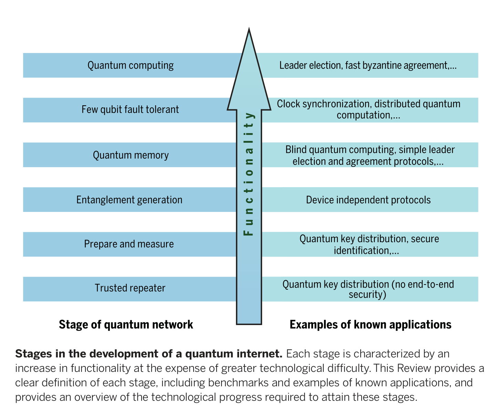
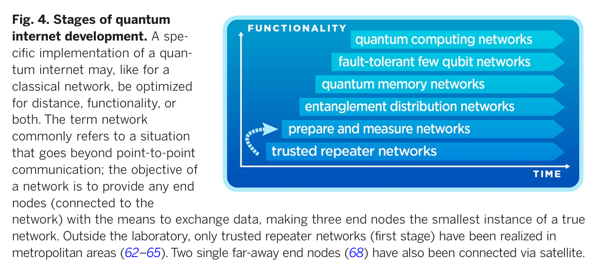
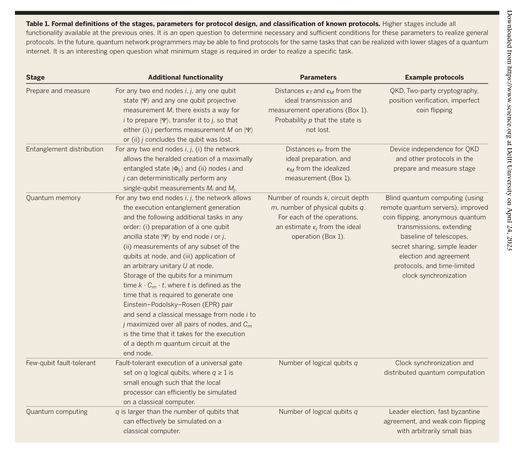
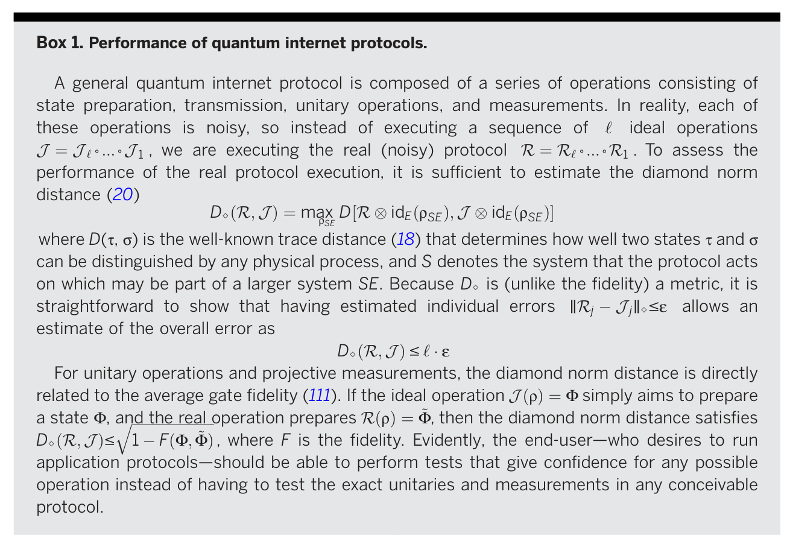

## `Quantum Internet: A vision for the road ahead`

1. Applications:  secure
communication, clock synchronization, extend-
ing the baseline of telescopes, secure identification, achieving efficient agreement on distributed data, exponential savings in communication, quantum sensor networks, as well as secure access to remote quantum computers on cloud.

2. 

3. 
    1. Trusted repeater networks
        * Does not allow the end-to-end transmission of qubits

        * Specifically, a trusted repeater network (sometimes called a trusted node network) has at least two end nodes and a sequence of short distance links that connect nearby intermediary repeater nodes. 

        * Each pair of adjacent nodes uses QKD (11–13) to exchange encryption keys.

        * These pairwise keys allow the end nodes to generate their own key, provided that all intermediary nodes are trusted.

    2. Prepare and measure networks
        * Offer end-to-end quantum functionality. It enables end-to-end QKD without the need to trust intermediary repeater nodes.

        * Informally, this stage allows any node to prepare a one-qubit state and transmit the resulting state to any other node, which then measures it (definition is provided in Table 1)

        * Transmission and measurement are allowed to be post-selected; that is, a signal that the qubit is lost may be generated instead. 

        * Such a post-selected prepare-and-measure functionality is not equivalent to transmitting arbitrary qubits across the network (18). The task of transmitting arbitrary qubits demands the ability to transfer an unknown state jYi (which the sender does not know how to prepare) deterministically to the receiver—that is, no post-selection on detection events is allowed.
    
    3. Entanglement distribution networks
        * Allows the end-to-end creation of quantum entanglement in a deterministic or heralded fashion, as well as local measurements. The end nodes require no quantum memory for this stage (Table 1).

        * The term “deterministic entanglement generation” refers to the fact that the process succeeds with (near) unit probability.

        * Heralding is a slightly weaker form of deterministic entanglement
        generation in which **we signal the successful generation of entanglement with an event that is independent of the (immediate) measurement of the entangled qubits themselves.** Here, the generation of entanglement is **deterministic, conditioned on such a successful heralding signal.** Specifically, this **prohibits post-selecting on detection events when measuring the entangled qubits.** We remark that this stage also includes networks that **allow the generation of multipartite entangled states, followed by immediate measurements, but no memory.** However, the generation of multipartite entanglement is not required to attain this stage.
        *  this stage allows the realization of device-independent protocols, in which the quantum devices are largely untrusted. 
        * Specifically, the concept of device independence (36, 37) models the end nodes as black boxes, to which we can give classical instructions to perform specific measurements and receive the resulting measurement outcomes. 

    4. Quantum memory networks
        * Distinguished by the capability of the end nodes to have local memory while simultaneously allowing universal local control.
        * Crucial difference: We are now able to transfer unknown qubits from one network node to another.
        * This capability is not guaranteed in the previous stage: Technology that can be used to deterministically relay qubits over long distances by means of large-scale quantum error correction implies the technological capability of realizing a good local quantum memory.
    
    5. Few-qubit fault-tolerant networks
        * local operations can be performed fault-tolerantly
        * The term “few qubits” here refers to the fact that the number of qubits available is still small enough so that the end nodes themselves can be simulated effectively on a classical computer. 

    6. Quantum computing networks

    

Very intuitively, the reason why quantum communication could ahelp solve these problems is that entanglement allows coordination among distant processors that greatly surpasses what is possible classically.

## `Quantum repeaters: From quantum networks to the quantum internet`

